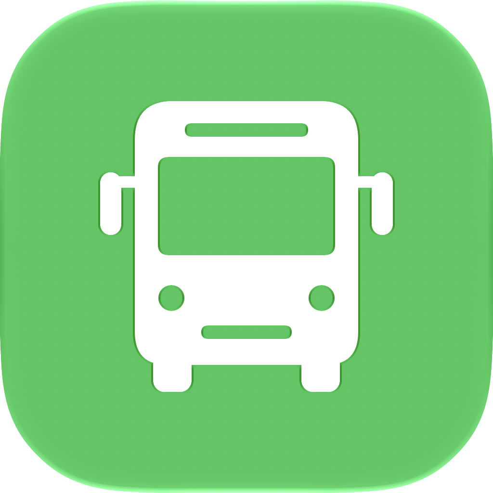

#  StopSet

StopSet is a SwiftUI app for comparing Auckland bus departures across a user-defined group of stops. Save the stops you use together, see their departures on one board, and follow a bus's last reported position on the map. Groups and preferences stay on your device, and your Auckland Transport API key is stored in Keychain.

## Features

### Stop Groups

- Create groups with one or more Auckland bus stops.
- Give each group a name, symbol, and colour.
- Edit, delete, and reorder saved groups.
- View all stops in a group on the map.
- Keep groups saved locally between launches.

### Stop And Address Search

- Search Auckland addresses with Apple Maps suggestions.
- Enter the start of a stop number, such as `21`, to find matching bus stops across Auckland.
- See matching stops above address suggestions, ordered by stop number.
- Select an address to discover nearby stops, or select a stop result to locate it on the map.
- See stop codes on map markers and in the stop list.
- Preview route numbers whose mapped lines pass near a selected stop.

### Departure Board

- Combine departures across all stops in a group.
- Distinguish live estimates from scheduled departure times.
- Filter by stop and one or more bus numbers together.
- Keep bus selections active during refreshes.
- Pull to refresh, or refresh automatically while the app is active.
- Choose a refresh interval of 10, 15, 30, or 60 seconds in Settings; the default is 30 seconds.

### Vehicle Map

- Open a departure to see the last reported vehicle position when Auckland Transport provides one.
- Refresh the vehicle map every 15 seconds while active.
- Recenter the map while keeping the trip details visible.

### iPhone And iPad

- Resizable stop-picker sheet over Apple Maps on iPhone.
- Side-by-side stop picker on iPad.
- Support for system appearance and Dynamic Type.
- App icon with light, dark, tinted, and clear appearances.

## Tech Stack

- Swift
- SwiftUI
- Observation framework
- MapKit and Apple Maps address search
- URLSession
- Auckland Transport ArcGIS, GTFS, and Realtime data
- UserDefaults for stop groups and preferences
- Keychain for the API key
- XCTest UI tests
- Apple Icon Composer
- iOS 18.0+

The app does not use third-party frameworks.

## Project Structure

```text
StopSet/
├── StopSet/
│   ├── App/                       App entry point and dependency composition
│   ├── Features/
│   │   ├── StopGroups/
│   │   ├── StopPicker/
│   │   ├── GroupEditor/
│   │   ├── Departures/
│   │   ├── VehicleMap/
│   │   └── Settings/
│   ├── Domain/
│   │   ├── Models/                Shared entities and settings values
│   │   └── Repositories/          Repository protocols
│   ├── Data/
│   │   ├── Repositories/          Transport, search, and storage implementations
│   │   ├── Services/              HTTP requests, decoding, and transit caches
│   │   ├── Storage/               Keychain access
│   │   └── Preview/               Deterministic UI-test data
│   ├── Shared/
│   │   ├── Components/            Reusable views and visual styling
│   │   └── ViewModels/            Component presentation models
│   ├── Assets.xcassets/
│   └── StopSetIcon.icon/
├── StopSet.xcodeproj/
├── StopSetUITests/
└── Design/                        App icon previews and documentation
```

## Architecture

StopSet follows a feature-based MVVM structure with use cases and repository interfaces:

```text
View → ViewModel → UseCase → Repository → API / local storage
```

- Each feature contains `Views`, `ViewModels`, and `UseCases`.
- Screen views own their `@Observable` view models with `@State`.
- Reusable components use immutable, input-driven view models.
- Views render UI and forward user actions to view models.
- View models manage screen state and call injected use cases.
- Use cases depend on repository protocols in `Domain`.
- Concrete repositories in `Data` access Auckland Transport, Apple Maps, UserDefaults, and Keychain.
- `AppDependencies` creates repositories, wires use cases, and builds screen view models.
- The shared stop-group repository publishes changes so group and departure screens stay synchronized.
- The group editor saves through `SaveStopGroupUseCase`; its callback completes the presentation flow.
- UI-test launches select a preview transit repository at the composition root.

The layers are folders within one app target. MapKit types remain in map and address-search contracts, so the domain is not a framework-independent module.

## Getting Started

### Requirements

- Xcode with support for Apple Icon Composer `.icon` files.
- iOS 18.0 or later.
- macOS with an iOS Simulator runtime installed, or a physical iPhone or iPad.
- Network access for address search and transport data.

### Run The App

1. Open the project in Xcode:

   ```sh
   open StopSet.xcodeproj
   ```

2. Select the `StopSet` scheme.
3. Choose an iPhone or iPad simulator, or a physical device.
4. For a physical device, select your signing team and update the `com.lancy.StopSet` bundle identifier if needed.
5. Build and run with `Cmd + R`.

### Connect Auckland Transport

Address search uses Apple Maps. Stop and nearby route discovery use Auckland Transport's public ArcGIS layers, so you can create groups without an API key.

Live departures and vehicle locations require an Auckland Transport developer key:

1. Open the [AT Developer Portal](https://dev-portal.at.govt.nz/) and obtain a subscription key with Realtime and GTFS access.
2. Open **Settings** in StopSet.
3. Enter the subscription key and tap **Save Key**.

The key is stored in the device's Keychain. You can remove it in Settings.

### Create Your First Group

1. Tap **+**, then search for an address or the start of a stop number.
2. Select a result and add one or more stops to your group.
3. Tap **Next**, name the group, and optionally choose a symbol and colour.
4. Open the saved group to compare departures. Use the stop menu and **All buses** selector to filter the board.
5. Tap a departure to open its vehicle map, or use the group's map button to view its stops.

Swipe right on a group to edit it, swipe left to delete it, or use **Edit** to reorder groups. Choose **All buses** in the bus selector to reset bus filters.

## Testing

Run the `StopSet` scheme's tests in Xcode with **Product > Test** (`Cmd + U`).

The UI tests cover:

- Creating and editing groups with one or more stops, including the one-stop minimum.
- Combined stop and address search, result ordering, text and mixed input, missing numbers, and stops outside the current map area.
- Departure filtering and both maps.
- Accessibility-sized text.
- Screenshot attachments in the test report.

UI tests launch with `--ui-testing` to use deterministic sample groups and departures. This Debug-only mode uses a separate preferences suite and does not change saved user groups. Normal launches use the real transport services.

The optional `StopSetLiveSearchTests` checks real Apple Maps suggestions while typing `21 holl` and `Queen Street`, then selects an address to load nearby stops. To enable it, set `TEST_RUNNER_STOPSET_LIVE_SEARCH_TESTS=1` in the environment when running `xcodebuild test`. It uses a normal app launch, requires network access, and is skipped by default.

## Current Limitations

- Stop timetables and live feeds are combined by trip ID. A downstream live estimate uses the vehicle's latest reported delay, so it may differ from AT Mobile's prediction. Untracked trips show scheduled times.
- Route numbers shown during stop selection are nearby map-line hints, not a guaranteed list of services at that stop.
- The direct-device API key setup is intended for a personal prototype. A public App Store release should proxy AT requests through a backend.
- The app does not estimate walking time.
